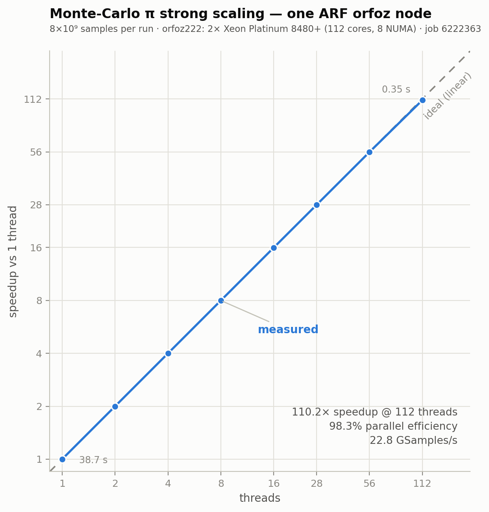

# 002 — Monte-Carlo π strong scaling

**Date:** 2026-08-10 · **Cluster:** ARF · **Job:** 6222363 · **Node:** orfoz222 · **Elapsed:** 1:17

## Goal

How close to linear does one full ARF node get on an embarrassingly parallel workload — and what *is* an orfoz node, physically?

## Method

[`pi.c`](pi.c): OpenMP Monte-Carlo π, per-thread xorshift64 PRNG (no shared state), 53-bit uniform doubles, `reduction(+:hits)`. Fixed workload of 8×10⁹ samples per run, thread sweep 1 → 112 inside a single 112-core job ([`job.slurm`](job.slurm)), `OMP_PROC_BIND=true`, gcc 11.3.1 `-O2`. Submitted via `tools/run.sh … -p debug` — the `-c 112` request steers it onto an orfoz-class node inside the debug pool.

## Results

| threads | seconds | speedup | efficiency |
|---:|---:|---:|---:|
| 1 | 38.666 | 1.00 | 100.0% |
| 2 | 19.339 | 2.00 | 100.0% |
| 4 | 9.670 | 4.00 | 100.0% |
| 8 | 4.837 | 7.99 | 99.9% |
| 16 | 2.419 | 15.98 | 99.9% |
| 28 | 1.384 | 27.94 | 99.8% |
| 56 | 0.693 | 55.80 | 99.6% |
| 112 | 0.351 | **110.16** | **98.3%** |

π lands within ~3×10⁻⁵ of the true value on every run (8×10⁹ samples ⇒ σ ≈ 1.8×10⁻⁵). Raw data: [`results/results.csv`](results/results.csv), [`results/pi_scaling_6222363.out`](results/pi_scaling_6222363.out).

## Findings

- **110.2× on 112 cores (98.3% efficiency)**, ≥ 99.6% through 56 threads. With zero shared state and one reduction, the hardware delivers essentially all of Amdahl's ceiling.
- **orfoz nodes are 2× Xeon Platinum 8480+** (Sapphire Rapids, 56 cores/socket, HT off, 8 NUMA domains). The mysterious "56/112 çekirdek" submit rule is just socket/full-node granularity.
- Throughput peaks at **22.8 GSamples/s** ≈ 204 M samples/s/core — matching the single-thread 207 M/s, i.e. purely compute-bound, no memory-bandwidth cliff for this kernel.
- `debug` accepts full-node 112-core jobs — quick whole-node experiments don't need orfoz's 3-day lane, and this one scheduled within seconds.

## Tooling (BACKLOG 008, closed)

`tools/run.sh` worked first try (shipped sources, submitted). `tools/fetch.sh`'s first invocation failed *silently*: `TRUBA_KEY` pointed at a `/tmp` copy that a WSL VM restart had wiped, and `|| true` swallowed the scp error. Fixed — it now warns when nothing lands. Standing lesson: **WSL `/tmp` is ephemeral; re-copy the key every invocation.**
