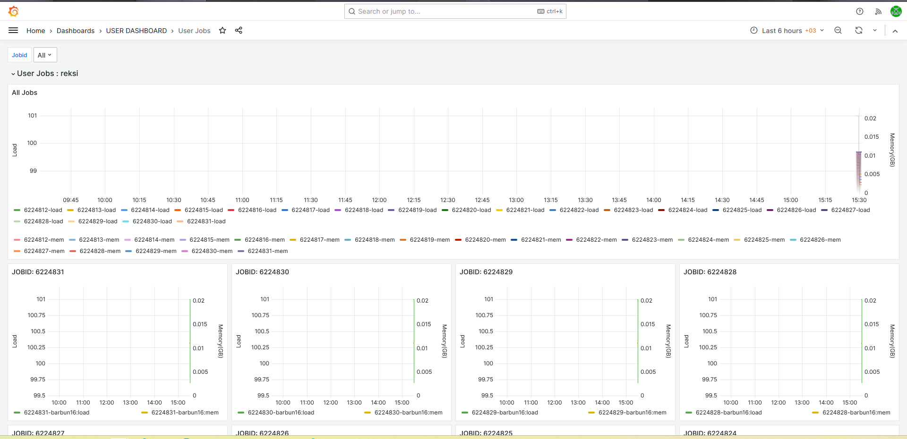

# 006 — Watch yourself on Grafana

**Date:** 2026-08-11 · **Jobs:** 6224812–6224831 (array `0-19`) · all COMPLETED

## Goal

Observability tourism: fire a deliberately tiny load burst (20 × 1-core × 150 s spin = 40 core-minutes) and catch it on TRUBA's own dashboards.

## What TRUBA gives you

Grafana at `http://172.16.6.25:3000` (VPN-only) includes a **USER DASHBOARD → User Jobs** view: an all-jobs load/memory timeline for your username plus a per-JOBID panel for every job, no setup required. Each array task appears as its own job id with its node's load pinned at 100% for the spin window.

## Notes

- Metrics appear with roughly a scrape-interval of lag — refresh after ~a minute, not instantly.
- This is the answer to "is my job actually using the cores/memory I asked for" — check the dashboard before profiling anything by hand.
- Sample task outputs in [`results/`](results/); the array pattern is [`burst.slurm`](burst.slurm).
