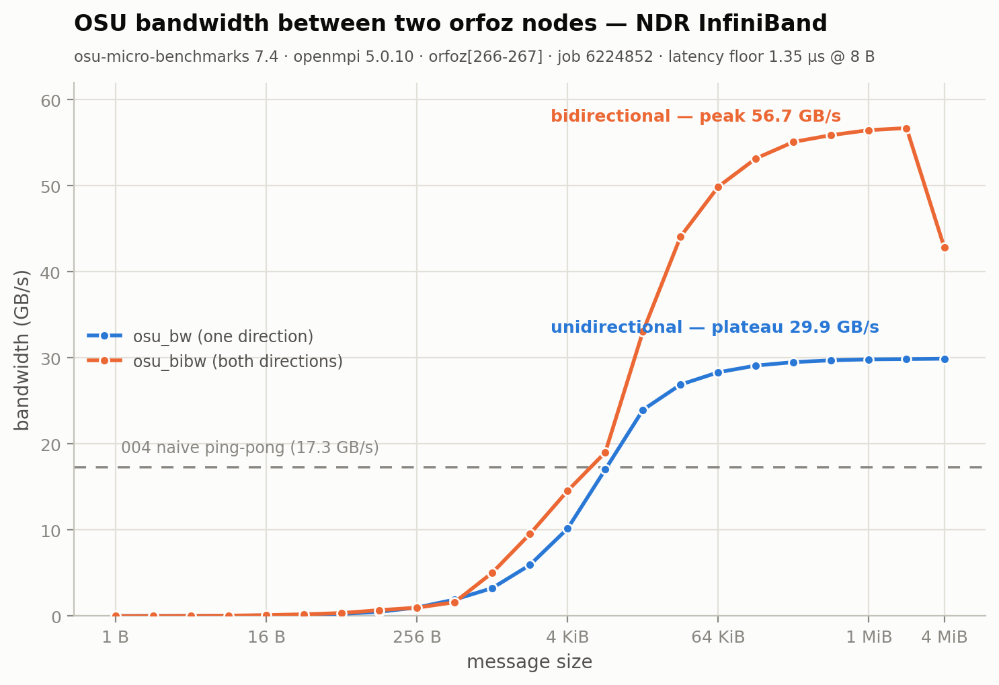

# 009 — OSU microbenchmarks: what the NDR fabric really does

**Date:** 2026-08-11 · **Jobs:** 6224811 (instructive failure), **6224852** (orfoz[266-267], 22 s)

## Goal

Replace 004's naive ping-pong numbers with the standard instrument: OSU micro-benchmarks 7.4 (`osu_latency`, `osu_bw`, `osu_bibw`), 1 rank per node across two orfoz nodes.

## Results ([raw](results/osu_6224852.out))



| Metric | 004 naive | 009 OSU | Δ |
|---|---:|---:|---|
| latency (8 B, one-way) | 5.19 µs | **1.35 µs** | 3.8× better |
| bandwidth (one direction) | 17.3 GB/s | **29.9 GB/s** plateau | 1.7× |
| bandwidth (bidirectional) | — | **56.7 GB/s** peak | — |

- 29.9 GB/s ≈ 60% of NDR's 50 GB/s per-direction line rate from a single rank pair with zero tuning — the fabric is genuinely fast; 004's gap was measurement technique (blocking ping-pong vs windowed sends), not hardware.
- The bidirectional 4 MiB dip (56.7 → 42.9 GB/s) is a protocol-switch artifact, reproducible in OSU results everywhere.
- Half-bandwidth point sits near 8–16 KiB: messages below that are latency-dominated — batch small messages.

## The failure that taught something (job 6224811)

`module load lib/openmpi/5.0.4` failed with *"Unable to locate a modulefile"* on orfoz[324-325] — the same module 004 had loaded fine on orfoz[204-205]. **Module trees are not identical across orfoz nodes.** The fix, now in [`job.slurm`](job.slurm): discover at runtime —

```bash
OMPIMOD=$(module -t avail 2>&1 | grep -E "^lib/openmpi/5" | sort -V | tail -1)
module load "$OMPIMOD"
```

(This run picked `lib/openmpi/5.0.10-cuda-13.0`; its CUDA plugin warnings on GPU-less nodes are harmless noise.)

## Lessons

- Never hardcode a module version in a job script on ARF; discover it.
- OSU builds from source in seconds on these CPUs (`./configure CC=mpicc && make -j16` inside the job) — no admin needed for proper fabric measurement.
- Real fabric budget for multi-node designs: ~1.4 µs + ~30 GB/s per direction, per pair.
